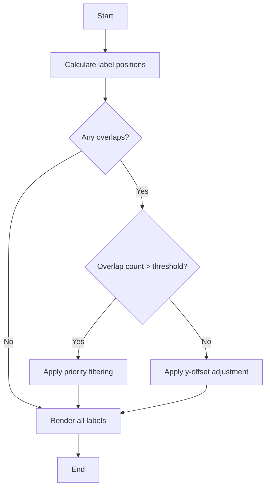

# Plan: Handling Overlapping Labels in Statistical Chart

## Problem Analysis

The current implementation in [`StatisticalChart.tsx`](src/components/StatisticalChart.tsx) renders tooltips for five statistical values:
- **Minimum** (line 391-396)
- **Q1** (line 397-402)
- **Median** (line 403-408)
- **Q3** (line 409-414)
- **Maximum** (line 415-420)

Each tooltip is a `foreignObject` with:
- Width: 80px
- Height: 40px
- Position: x = xScale(value), y = fixed offset

**Issue**: When values are close together (narrow distribution), these tooltips overlap because they have fixed dimensions and no collision detection.

---

## Proposed Solutions

### Solution 1: Y-Offset Staggering (Recommended)
Alternate the y-position of labels to create a "staggered" effect:

```typescript
// Current positions (all overlapping)
y={whiskerY - 15}  // Min, Max
y={boxY}           // Q1, Median, Q3

// Proposed staggered positions
y={whiskerY - 55}  // Minimum (top-most)
y={boxY - 45}      // Q1 (above box)
y={boxY + boxHeight + 5}  // Median (below box)
y={boxY - 45}      // Q3 (above box, same as Q1 but won't overlap due to x-distance)
y={whiskerY - 55}  // Maximum (top-most)
```

**Pros**: Simple to implement, maintains all labels visible
**Cons**: May still overlap if values are extremely close

---

### Solution 2: Dynamic Collision Detection with Smart Positioning
Calculate overlaps and dynamically adjust positions:

```typescript
interface LabelPosition {
  id: string;
  x: number;
  y: number;
  width: number;
  height: number;
}

const detectOverlaps = (labels: LabelPosition[]): LabelPosition[] => {
  // Check each pair for overlap
  // If overlap detected, adjust y-position of one or both labels
  // Use alternating pattern: some above, some below
}
```

**Pros**: Handles all edge cases, mathematically optimal
**Cons**: More complex implementation

---

### Solution 3: Hybrid Approach (Best Balance)
Combine staggered positions with collision detection:

1. **First pass**: Apply staggered y-offsets
2. **Second pass**: Check for remaining overlaps
3. **Third pass**: If overlap persists, hide less critical labels (e.g., hide Q1/Q3 if they overlap with Median)

```typescript
const getLabelPositions = (data: BenchmarkData, xScale, boxY, whiskerY, boxHeight) => {
  const tooltipWidth = 80;
  const tooltipHeight = 40;
  
  const labels = [
    { id: 'min', value: data.min, x: xScale(data.min), y: whiskerY - 55, priority: 2 },
    { id: 'q1', value: data.q1, x: xScale(data.q1), y: boxY - 45, priority: 1 },
    { id: 'median', value: data.median, x: xScale(data.median), y: boxY + boxHeight + 5, priority: 3 },
    { id: 'q3', value: data.q3, x: xScale(data.q3), y: boxY - 45, priority: 1 },
    { id: 'max', value: data.max, x: xScale(data.max), y: whiskerY - 55, priority: 2 },
  ];
  
  // Detect overlaps and hide lower priority labels
  return resolveOverlaps(labels, tooltipWidth);
};
```

**Pros**: Balances simplicity with robustness
**Cons**: Requires careful priority assignment

---

### Solution 4: Interactive Tooltips (Alternative)
Replace static labels with hover-only tooltips:

- Show only the value being hovered
- Use a single tooltip that follows the mouse
- Display all values in a legend instead

**Pros**: Eliminates overlap entirely
**Cons**: Reduces immediate visibility of all values

---

## Recommended Implementation Plan

### Step 1: Implement Y-Offset Staggering
Modify the Tooltip positions in [`StatisticalChart.tsx`](src/components/StatisticalChart.tsx:391-420):

```typescript
// Current
<Tooltip label="Minimum" value={`${data.min.toFixed(2)}`} x={xScale(data.min)} y={whiskerY - 15} />
<Tooltip label="Q1" value={`${data.q1.toFixed(2)}`} x={xScale(data.q1)} y={boxY} />
<Tooltip label="Median" value={`${data.median.toFixed(2)}`} x={xScale(data.median)} y={boxY} />
<Tooltip label="Q3" value={`${data.q3.toFixed(2)}`} x={xScale(data.q3)} y={boxY} />
<Tooltip label="Maximum" value={`${data.max.toFixed(2)}`} x={xScale(data.max)} y={whiskerY - 15} />

// Proposed
<Tooltip label="Minimum" value={`${data.min.toFixed(2)}`} x={xScale(data.min)} y={whiskerY - 55} />
<Tooltip label="Q1" value={`${data.q1.toFixed(2)}`} x={xScale(data.q1)} y={boxY - 45} />
<Tooltip label="Median" value={`${data.median.toFixed(2)}`} x={xScale(data.median)} y={boxY + boxHeight + 5} />
<Tooltip label="Q3" value={`${data.q3.toFixed(2)}`} x={xScale(data.q3)} y={boxY - 45} />
<Tooltip label="Maximum" value={`${data.max.toFixed(2)}`} x={xScale(data.max)} y={whiskerY - 55} />
```

### Step 2: Add Collision Detection Hook
Create a `useLabelPositions` hook that:
1. Takes all label positions
2. Detects overlaps using bounding box intersection
3. Returns adjusted positions with overlaps resolved

### Step 3: Add Priority-Based Filtering
If collision detection still finds overlaps:
- Keep Median (highest priority)
- Keep Min/Max (important boundaries)
- Hide Q1/Q3 if they overlap with Median

---

## Visual Representation



---

## Files to Modify

1. [`src/components/StatisticalChart.tsx`](src/components/StatisticalChart.tsx) - Main implementation
   - Lines 391-420: Update tooltip positions
   - Add collision detection logic

---

## Questions for Clarification

1. **Which solution do you prefer?** (Y-offset staggering, collision detection, hybrid, or interactive tooltips?)
2. **Should Q1/Q3 be hidden if they overlap with Median?** (Priority-based filtering)
3. **Do you want tooltips to be interactive (hover-only) instead of always visible?**
